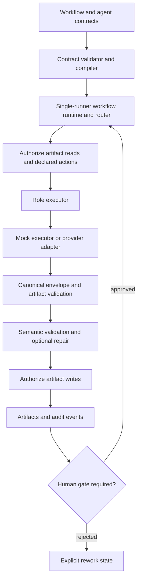

# AI Quality Platform

## What this is

AI Quality Platform is an experimental, governed multi-agent quality and
reliability system for software and AI-assisted engineering workflows. It is a
portfolio project focused on AI systems engineering, AI quality, multi-agent
orchestration, model routing, runtime governance, and evidence-driven QA.

The repository demonstrates how agent work can be made inspectable and bounded:
roles have explicit responsibilities, workflows and artifacts have typed
contracts, model selection is separated from provider configuration, and human
judgment remains part of high-impact decisions.

## Why I built it

LLM agents can generate useful work, but production-minded use requires more
than prompts. A trustworthy system also needs explicit boundaries around what an
agent may do, validation of what it returns, evidence for what happened, and a
clear point at which a human must decide.

This project explores those concerns through typed contracts, specialized roles,
default-deny authorization, strict structured outputs, schema and semantic
validation, human gates, durable evidence, audit events, and cost-aware logical
model tiers.

## Current architecture



The implemented layers are:

1. Declarative roles, skills, standards, workflows, capabilities, and schemas.
2. Contract validation and immutable compilation with instruction hashes.
3. A provider-neutral, SQLite-backed workflow runtime.
4. Logical model-tier routing and routing telemetry.
5. Default-deny capability and artifact-I/O authorization.
6. Provider-neutral execution with an OpenAI Responses API adapter.
7. Strict provider output plus canonical artifact validation.
8. Semantic cross-field validation and one evidence-preserving repair attempt.
9. Persisted human gates with evidence hashes and stale-gate invalidation.
10. Artifact, provider-attempt, authorization, routing, and event records.

For more detail, see the [staged Architecture Wiki page](docs/wiki-staging/Architecture.md).

## Agent operating model

- **Skills** define reusable workflows and methods.
- **Roles** define specialized responsibilities and handoff expectations.
- **Standards** provide shared rules without duplicating them in every role.
- **The registry** wires roles, skills, standards, capabilities, providers, and
  workflows together in a machine-readable contract.

Routing uses provider-neutral logical tiers: `economy`, `standard`, and
`high_reasoning`. Concrete model IDs come from provider configuration rather
than role or workflow files. The routing policy aims to use the least-expensive
tier that can reliably perform the role, with explicit escalation rules.

## Governance and safety

Implemented safeguards include:

- default-deny capability authorization;
- task- and resource-scoped permissions;
- explicitly gated capabilities;
- approvals resolved from persisted runtime state;
- evidence hashes and stale-gate invalidation;
- provider-neutral canonical artifact validation;
- semantic validation before artifact acceptance;
- bounded repair and escalation behavior;
- provider attempts recorded before network dispatch;
- durable authorization and event telemetry;
- default redaction of raw provider output from inspection;
- OpenAI Responses requests configured with `store=False`;
- no real side-effect/action adapters in the current milestone.

The authorization layer is application-level governance, not an
operating-system sandbox. Filesystem, shell, deployment, publishing, and other
real action adapters require additional isolation work before they are enabled.

## Human-in-the-loop design

Humans are intentionally retained where independent judgment is valuable:
high-risk design approval, release or outward-action approval, subjective
assessment, and unresolved ambiguity. Gate approvals are bound to current
evidence. If evidence changes, approval must be requested again. A rejection
produces an explicit rework transition rather than being misreported as a
runtime crash.

## Real provider milestone

The first real-provider smoke test executed the `architect` role through OpenAI's
Responses API at the provider-neutral `high_reasoning` tier. It produced the
existing `automation_design` and `sources_of_record` artifacts, passed their
canonical schemas, required no repair in the successful run, made no tool calls
or outward actions, and stopped at the human design gate as intended.

No API key or private model response is stored in this repository. Requirements
Analyst and Adversarial Verifier are now real-provider-demonstrated in the
opt-in `qa-provider-demo` workflow. One controlled run preserved a natural
ambiguity escalation and stopped at `INSUFFICIENT_EVIDENCE`; a second reached a
pending human `qa_signoff` gate without auto-approval. QA Intake remains
deterministic and is canonically validated before acceptance. No real
side-effect adapters are enabled, and an economy-tier real-provider role remains
outstanding under Issue #8.

## Adversarial verification

A dedicated adversarial review of the first executable milestone found trust-
boundary defects despite a green test suite. Findings included a provider-
neutral schema bypass, stale pending-gate evidence, caller-forged capability
approvals, artifact-I/O authorization gaps, missing audit evidence for denied
decisions, unbounded escalation, and provider crash/retry duplication risk.

Those defects were fixed before merge. The episode is intentionally documented:
passing tests are evidence, but they do not prove that a system's guarantees
cannot be bypassed. Adversarial verification is therefore part of the platform's
operating model rather than a final cosmetic review.

## Testing

The validation stack includes:

- repository and contract validation;
- deterministic offline unit and integration tests;
- Python compilation checks;
- adversarial review and targeted negative tests;
- an optional, explicitly enabled real-provider smoke test.

This feature branch passes **101 offline tests**. Real-provider tests are opt-in
and are not part of ordinary offline validation.

## Repository structure

```text
.agents/       Agent registry, roles, skills, standards, workflows, and schemas
orchestration/ Compiler, context builder, authorization, providers, and runtime
tests/         Offline contract, runtime, authorization, and provider tests
tools/         Validation, demonstrations, and the optional provider smoke test
knowledge/     Working memory plus the lightweight canonical Wiki map
docs/          Publication-ready reviewer and Wiki staging documentation
```

## Roadmap

Tracked follow-up work is deliberately separated from implemented behavior:

- [#2 Run leasing and concurrent resume protection](https://github.com/MiaArmstrong/ai-quality-platform/issues/2)
- [#3 Filesystem path canonicalization](https://github.com/MiaArmstrong/ai-quality-platform/issues/3)
- [#4 Declarative semantic rule registry](https://github.com/MiaArmstrong/ai-quality-platform/issues/4)
- [#5 Configurable warning policy](https://github.com/MiaArmstrong/ai-quality-platform/issues/5)
- [#6 Reusable authorization policy profiles](https://github.com/MiaArmstrong/ai-quality-platform/issues/6)
- [#7 Isolated real action adapters](https://github.com/MiaArmstrong/ai-quality-platform/issues/7)
- [#8 Additional provider-enabled roles](https://github.com/MiaArmstrong/ai-quality-platform/issues/8)

## Status

This is active, experimental portfolio engineering work. It demonstrates a
tested architectural foundation; it is not production-ready software. The
runtime is intentionally single-runner, real side-effect adapters are absent,
and Architect, Requirements Analyst, and Adversarial Verifier have completed
bounded real-provider milestones. Economy-tier real-provider execution remains
outstanding.

---

Copyright © 2026 Mia Armstrong. All rights reserved.

See [COPYRIGHT](COPYRIGHT) for usage terms.
